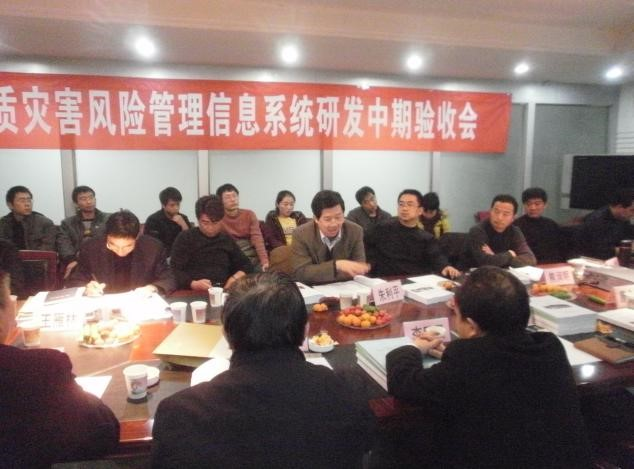
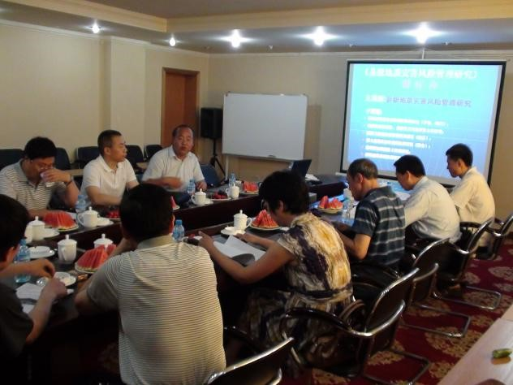
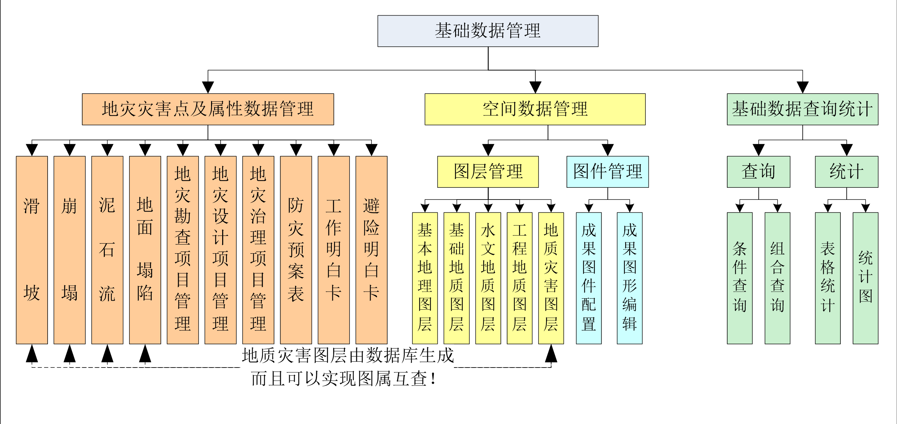
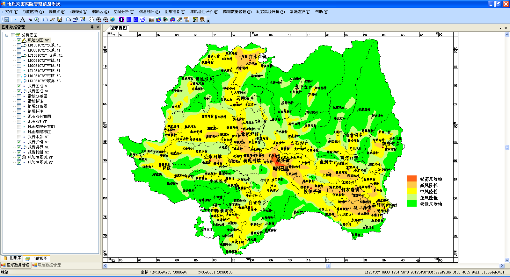
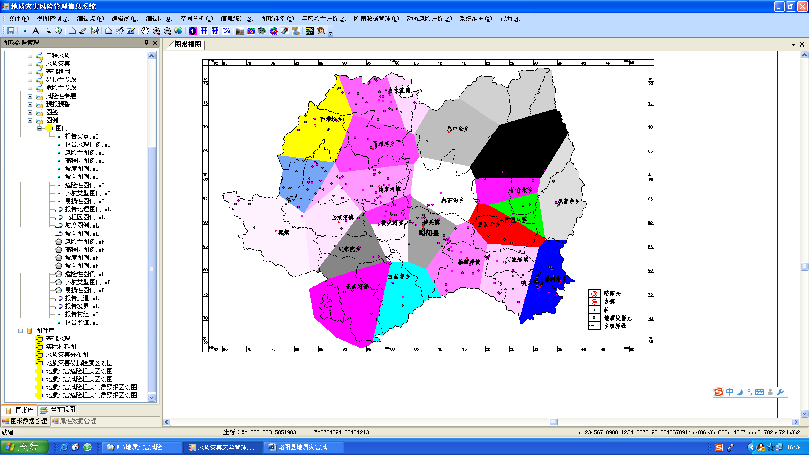
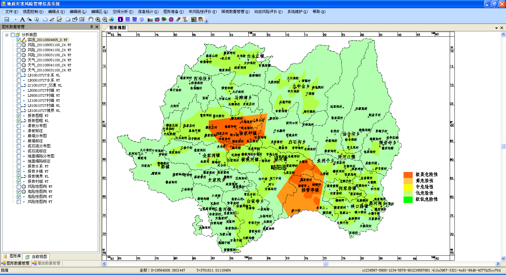
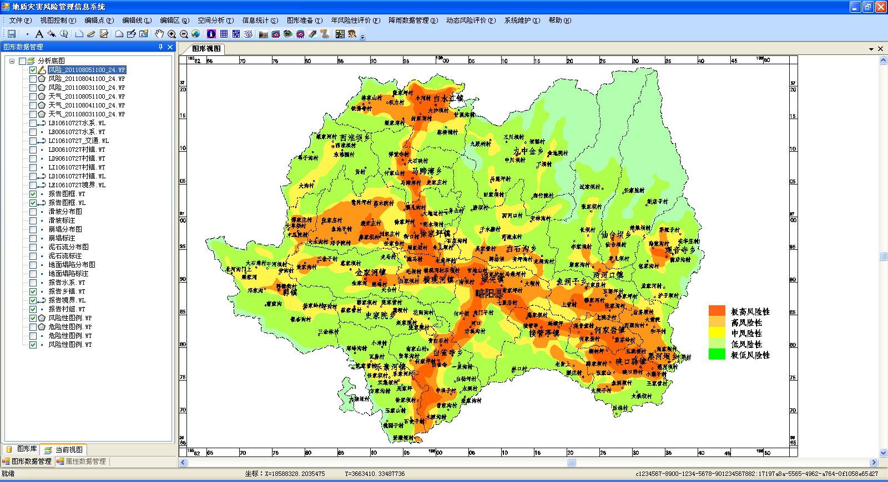
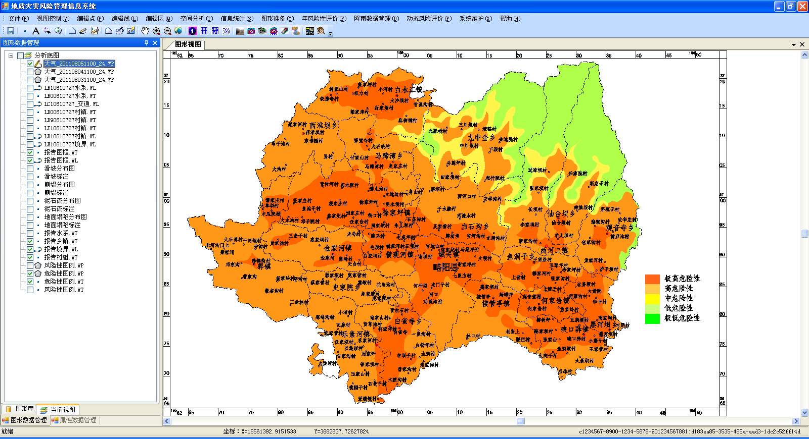

# 陕西中诚环境治理规划设计有限公司
[TOC]
### 简介
陕西中诚环境治理规划设计有限公司是依托多所高校和科研院所成立的综合设计咨询企业，公司主要从事水利水电、水土保持工程设计、城市规划及建筑工程设计、土地规划设计、生态环境工程规划设计、岩土工程勘察设计、地质灾害治理勘查设计、技术咨询服务等业务。
### 企业使命：
加强生态环境保护修复，实现自然和谐统一。
### 核心价值：
诚信、创新、绿色、和谐、共享
### 发展理念：
加强合作，打造利益共同体；技术创新，提升核心竞争力；优质服务，与客户实现共赢。
### 战略目标：
确保整体业务规模与盈利能力的稳定，加强生态保护修复研究，积极探索、培育新业务和发展模式以形成业务平台，为实现美丽陕西贡献力量。
### 企业愿景：
设计未来，创造卓越，铸造品质，成就第一。整合资源，实行产学研结合、设计咨询、工程总承包业务板块有机结合、相互促进、共同发展，打造生态保护修复平台、引进和培养一支生态保护修复的创新研究团队，成为行业领域骨干力量。        。
### 技术团队：
公司现拥有各类技术人才58人，其中教授10人、教授级高工2人、高级工程师15人。拥有地质灾害管理及预报预警系统研发和黄土高原生态保护修复关键技术研究2个研发团队。
### 公司业绩：
公司先后和多家科研院所签订了合作协议，参与了咀河上游生态保护修复与景观提升、周河流域生态保护修复、宁赛川流域生态保护修复、三道沟矿山生态保护修复等项目，项目涉及河道治理、水环境治理、水生态修复、水土流失治理、土地整治、地质灾害治理、矿山环境生态修复、城市生态修复、生态农业、农村环境整治等领域。
我们始终秉承“诚信、创新、绿色、和谐、共享”的经营理念，将诚信作为立企之本，将人才、质量、绿色、和谐、共享作为兴企之道，乘生态文明建设之东风，努力开展生态保护修复类工程实践，为美丽陕西做出应有的贡献。
### 公司蓬勃发展之际，欢迎水利、土地整治、岩土工程人才加盟。 
联系人：魏主任
电话：13700225686
## 地质灾害管理及预报预警系统研发团队
### 简介
我公司联合中国有色金属工业西安勘察设计研究院、西安科技大学、西安建筑科技大学、长安大学、西安理工大学、西安工业大学、陕西省地质环境监测总站、陕西省地质调查院的多名教授、专家，成立了“地质灾害管理及预警预报系统研发团队”，致力于地质灾害的风险管理和预警预报研究。

目前，利用勉县、略阳、宁强、陈仓灾后重建资金，由我团队负责完成了勉县膨胀土滑坡机理研究、宁强县堆积层滑坡机理研究、略阳县堆积层滑坡机理研究、陈仓黄土地质灾害成因机理研究、微型桩对浅层滑坡的加固机理研究、县域地质灾害风险管理研究、县域地质灾害气象预报预警研究、地质灾害风险管理系统建设研究等。通过上述研究，建成了“县域地质灾害风险管理信息系统”。该项目获得陕西省科技二等奖、陕西优秀勘察工程一等奖。

县域地质灾害风险管理系统（CGHRMIS）是在MAPGIS6.7软件开发包的基础上，采用.net Framework和C#等开发语言进行二次开发，主要用于我国县级国土资源部门对县域地质环境和地质灾害等相关数据进行信息化管理、对地质灾害的危险性、易损性、风险性等进行计算、分析评价、预报预警及风险控制等，以提升对地质灾害的防治水平及防灾减灾能力，为县域土地资源利用规划提供技术依据。系统主要包括用户管理和安全管理、基础数据（属性数据和空间数据等）管理、空间分析、地质灾害风险评价和预警预报及信息发布等功能。
* 1）系统维护与用户管理功能
系统维护和用户管理主要包括四个功能，分别是服务器连接配置、空间图形库配置、用户安全及权限管理及气象、易损性基础数据管理。
 系统维护和用户管理的系统结构图
其中服务器连接配置包括数据开服务器和FTP服务器配置，其中数据库连接配置主要配置服务器名称、数据库名称和用户名和密码，FTP服务器配置包括服务器名称、用户名和密码；空间图形库配置对不同地质灾害不同种类不同规模设置不同的子图和相关子图属性进行配置，以及地质灾害标注的配置；用户安全及权限管理模块主要包括用户基本信息、系统功能配置、角色权限设置、用户权限和安全设置等；气象、易损性基础数据管理包括气象代码管理、雨量站导入、人员数据导入、财产数据导入、专业监测点配置及其监测数据导入等。
* 2）基础数据管理功能
基础数据管理包括地质灾害点及属性数据管理功能、空间图形数据管理和基础数据查询统计功能。
地质灾害点数据管理主要包括地质灾害的属性数据和多媒体数据录入、修改、删除、浏览功能；属性数据管理功能包括地质灾害点对应的勘查、设计和治理项目的管理、地质灾害点的防灾预案表、工作明白卡和避险明白卡等。
空间数据管理功能包括空间图件的图层管理和成果图件管理功能；图层管理主要针对五类图层，包括基本地理图层（含行政区划图层）、基础地质图层、水文地质图层、工程地质图层、地质灾害图层；图件管理包括成果图件配置和成果图形编辑；其中地质灾害图层是根据地质灾害图形配置由地质灾害数据库自动生成，而且可以实现地质灾害图层与灾害数据实现图属互查。
基础数据查询统计功能包括灾害点的简单查询、高级查询，也包括地质灾害数据汇总、统计等，并对统计结果以饼图的形式展示比例。

数据管理的的系统结构图
* 3)气象数据管理功能
气象数据的管理主要用来对市气象局每天发布的24小时天气预报数据及临灾气象预报数据、县雨量监测站的实况雨量数据等进行管理。

* 4)空间分析功能
空间分析能够提供图形数据的叠置分析、缓冲区分析等功能。让用户能够利用满足文件结构要求的任意文件之间进行必要的空间分析操作，得出相应的分析结果，该功能主要是方便高端用户进行基础图形数据处理和分析，具体包括区区求并、区区求交、区区求差、线区求交、点区求交、点缓冲区、线缓冲区、区缓冲区、单点缓冲区、单线缓冲区和单区缓冲区。

* 5)县域地质灾害风险评价功能
县域地质灾害风险性评价包括地质灾害年风险性评价和地质灾害动态风险性评价。

县域地质灾害风险性评价与区划必须根据县域地质环境、社会经济、人口分布等调查数据进行县域地质灾害危险性评价与区划、根据地质灾害威胁的人口和财产及其它们承受灾害的能力和可能性进行县域地质灾害易损性评价与区划，并在此基础上利用生成的区域地质灾害危险性区划图和区域地质灾害易损性区划图进行县域地质灾害风险性区评价，最终生成县域地质灾害年风险性区划图。

* 6)单体地质灾害风险评价功能
单体地质灾害风险性评价包括年风险性评价和动态风险性评价。单点年风险性评价包括滑坡、崩塌、泥石流和地面塌陷等地质灾害单体进行单体年风险性评价，包括计算单点灾害的年发生概率、到达承灾体的概率估算、承灾体暴露在灾害面前的时空概率估算和进行承灾体易损性评价等内容。

* 7)地质灾害预报预警与信息发布功能
根据气象局上传的降雨数据和监测数据，系统自动完成各单体地质灾害的危险性及风险性进行计算、能够自动对区域地质环境危险性进行区划，结合相关标准或等级进行地质灾害与地质环境的危险性预报预警及风险性预报预警，并把相关信息结合Web等途径给公众进行实时发布。

     

<!-- TODO -->
条件下县域动态危险性评价结果图

2011年气候异常，勉（县）略（阳）宁（强）多次遭受百年不遇强降雨天气，诱发了多处地质灾害，西勘院先后30余次进行现场应急调查和应急排险，并对《县级地质灾害风险管理系统》进行了试运行，利用该系统对勉略宁地质灾害监测点发布预警预报100余次，并及时对威胁群众进行撤离，确保了所有监测点未发生人员伤亡事件。该系统目前已通过专家组验收，运行效果良好。
## 黄土高原生态保护修复关键技术研究团队
### 简介
   我公司联合中国有色金属工业西安勘察设计研究院、西安理工大学、西北农林科技大学、西安科技大学、西安建筑科技大学、长安大学、西安工业大学的多名教授、专家，成立了“黄土高原生态保护修复关键技术研究团队”，致力于下列领域的研究。
* 1.陕西黄土高原区废弃矿山生态修复技术
研究内容：研究矿产资源开发对区域生态安全的影响途径和机制，研发矿区水土资源保护和利用、采矿迹地水土流失控制、植被重建等生态恢复技术和生态安全保障技术，形成采矿工程与生态修复一体化技术体系并进行一定规模的示范。
* 2.黄土高原人工生态系统结构改善和功能提升技术
研究内容：研发和集成现有区域植被的结构调整、稳定性维持及功能提升技术、水土资源与生态系统高效耦合技术、坡面和流域尺度生态系统综合配置技术，建立区域性植被（含经济林）-土壤生态系统服务功能评价体系与提升技术标准，开展试验示范，形成区域人工生态系统结构调整和功能提升技术体系，满足区域人工生态系统的稳定性维持及可持续发展。
* 3.陕西黄土高原生态保护修复技术与示范
研究内容：进行陕西黄土高原区域生态系统演变规律研究，重点开展陕西黄土高原区域生态系统演变规律和驱动机制、多因子耦合作用下生态修复可持续性维持机制等研究，研究区域水土资源和生态系统空间分布格局、生态系统承载力、利用方向及调控途径。针对黄土高原水土流失严重的问题，研发构建水土流失综合防治技术及生态衍生产业技术，集成区域水土流失综合治理技术体系和生态产业模式，发展生态治理与生物农业、生态旅游等产业协同技术，培育和发展生态产业，构建生态治理、生态产业、生态富民相结合的产业化生态治理模式。
* 4.陕西省黄土高原区城市生态保护修复技术与示范
 研究内容：根据黄土高原水资源短缺、水污染严重、水生态系统破坏严重和城市扩张开挖形成高陡边坡加剧水土流失和植被破坏等现状，研究黄土高原区城市化地区生态演变规律，阐明城市化对区域生态环境的影响机理及其效应，探讨区域生态对城市发展的生态支撑作用，揭示城市化与区域生态的耦合机制，研发城市生态保护修复技术与示范，为城镇可持续发展和让更多人分享生态福祉奠定基础。
* 5.陕西黄土高原生态质量监测、安全评估与预警技术
研究内容：研究生物多样性、生态要素及生态功能等生态系统综合监测方法，制定生态质量长期生态监测的技术体系及生态系统观测研究网络的观测技术标准，研发生态要素监测的信息采集-实时传输-远程监控的物联网技术。建立生态承载力评价指标体系和评估模型方法，开展典型生态承载力与产业一致性评价技术研究；探讨生态安全评估指标体系与方法，研发生态安全阈值界定和承载力预测预警系统关键技术，构建生态监测与管理系统。